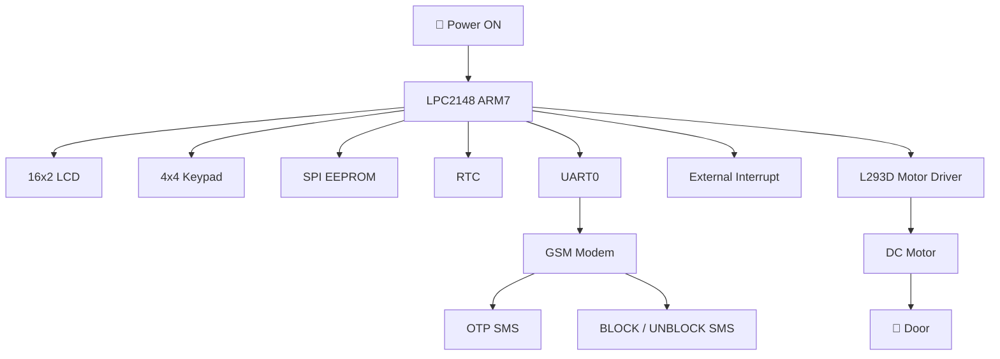
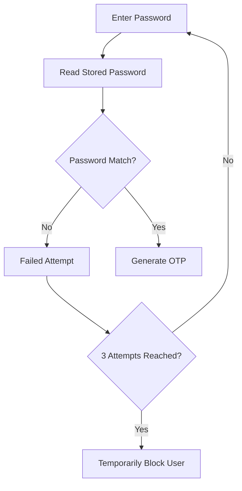
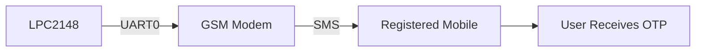
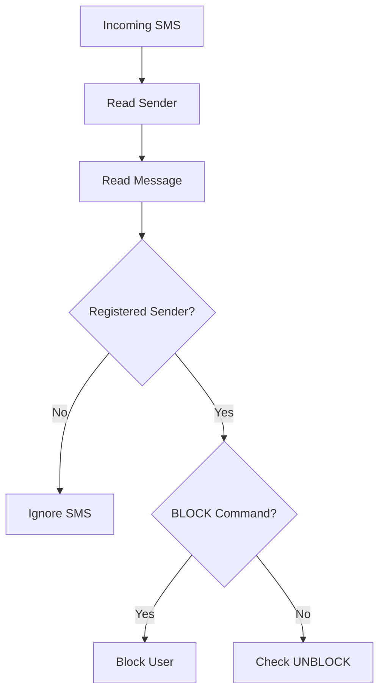
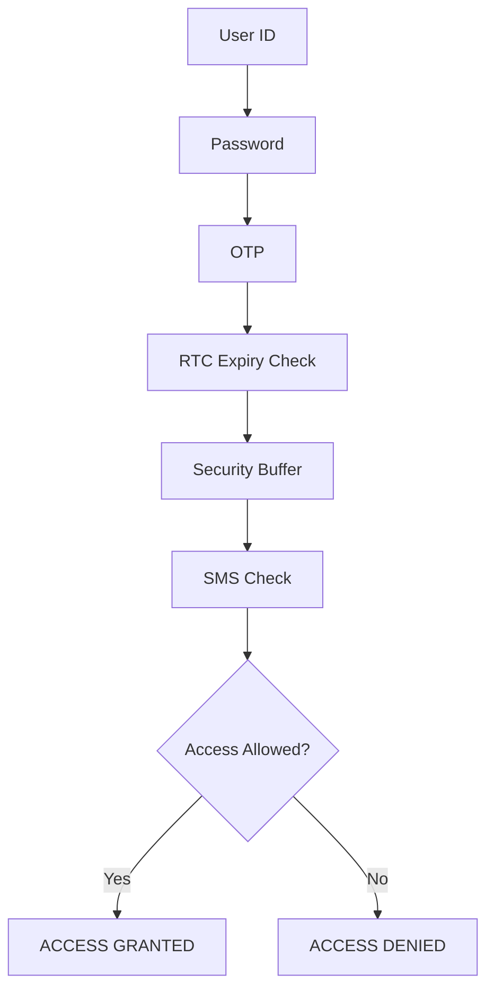
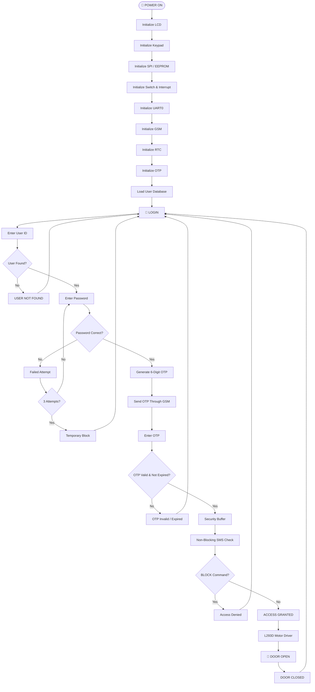
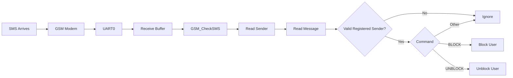

<div align="center">

# 🔐 **SecureEntry OTP**

## 🚪 **GSM-Based Two-Step Time-Limited Door Access System**

### 🔑 Two-Step Authentication • ⏱️ Time-Limited OTP • 📱 GSM Security • 🚪 Smart Door Access

</div>

---

## 📌 Project Overview

**SecureEntry** is an embedded security system developed using the **ARM7 LPC2148 microcontroller** to provide secure and controlled access to a door.

The system uses **multi-level authentication**, combining:

* User ID
* Password
* GSM-based One-Time Password (OTP)
* RTC-based OTP expiry
* SMS-based BLOCK / UNBLOCK control

User credentials and other important information are stored permanently in an external **SPI EEPROM**.

The system also provides an **Admin/User Management** facility for adding, deleting, modifying, blocking, and unblocking users.

After successful authentication, the LPC2148 controls a DC motor through an **L293D motor driver** to open and close the door.

---

# 🎯 Objectives

The main objectives of SecureEntry are:

* 🔑 Provide multi-level user authentication.
* 📱 Generate and send OTP through GSM.
* ⏱️ Implement OTP expiry using RTC.
* 💾 Store user information permanently in EEPROM.
* 🔒 Protect accounts against repeated incorrect passwords.
* 📩 Allow authorized BLOCK / UNBLOCK commands through SMS.
* 👨‍💼 Provide Admin-based user management.
* 🚪 Automatically control the door using a DC motor.
* 🛠️ Provide EEPROM and GSM diagnostic information.
* ⚡ Monitor incoming SMS without blocking the main system operation.

---

# ⭐ Key Features

| Feature                       | Description                                            |
| ----------------------------- | ------------------------------------------------------ |
| 🔐 Multi-Level Authentication | User ID + Password + OTP                               |
| 📱 GSM OTP                    | OTP delivered through registered mobile number         |
| ⏱️ RTC Security               | OTP expiry based on real-time clock                    |
| 💾 EEPROM Storage             | Permanent storage of user information                  |
| 🔒 Password Lockout           | Temporary blocking after repeated failures             |
| 📩 SMS Control                | BLOCK / UNBLOCK user through SMS                       |
| 👨‍💼 Admin Mode              | Add, delete, modify and manage users                   |
| 🚪 Door Control               | DC motor controlled through L293D                      |
| 📟 LCD Interface              | Displays system status and instructions                |
| 🔢 Keypad Interface           | Used for user input                                    |
| 🛠️ Diagnostics               | EEPROM and GSM communication checks                    |
| ⚡ Non-Blocking SMS            | Incoming SMS checked without stopping normal operation |

---

# 🏗️ System Architecture



---

# 🔄 Complete Step-by-Step Workflow

## Step 1 – Power ON

When the system is powered ON, the **LPC2148 ARM7 microcontroller** starts execution.

```text
POWER ON
   ↓
LPC2148 Starts
```

---

## Step 2 – Peripheral Initialization

The required peripherals are initialized.

```text
LCD
 ↓
Keypad
 ↓
SPI0 / EEPROM
 ↓
User Management Switch
 ↓
External Interrupt
 ↓
UART0
 ↓
GSM
 ↓
RTC
 ↓
OTP Module
 ↓
User Database
```

---

## Step 3 – System Ready

After initialization, the system enters the normal operating state.

```text
SYSTEM READY
      ↓
    LOGIN
```

The system waits for the user to enter the required credentials.

---

## Step 4 – Enter User ID

The user enters a **4-digit User ID** using the keypad.

```text
ENTER USER ID
      ↓
SEARCH EEPROM
```

The system searches the stored user database.

### If User ID is not found:

```text
USER NOT FOUND
```

### If User ID is found:

The system proceeds to password verification.

---

## Step 5 – Password Verification

The user enters the corresponding **4-digit password**.

The password is compared with the password stored in EEPROM.



The system allows a maximum of **3 password attempts**.

After the maximum number of failed attempts, the user is temporarily blocked.

**Block duration: 120 seconds**

---

# Step 6 – OTP Generation

After successful password verification, the system generates a **6-digit OTP**.

```text
PASSWORD CORRECT
       ↓
GENERATE OTP
       ↓
START OTP TIMER
```

OTP range:

```text
Minimum OTP = 100000
Maximum OTP = 999999
```

The OTP is associated with the current RTC time.

---

# Step 7 – Send OTP Through GSM

The generated OTP is sent to the user's registered mobile number through the GSM modem.



UART0 communication:

```text
P0.0 → TXD0
P0.1 → RXD0

Baud Rate → 9600 bps
```

---

# Step 8 – Enter OTP

The user enters the OTP received on the registered mobile phone.

```text
ENTER OTP
    ↓
COMPARE OTP
    ↓
CHECK RTC EXPIRY
```

The system checks:

1. Whether the entered OTP matches.
2. Whether the OTP is still valid.

---

# Step 9 – OTP Validation

### Invalid OTP

```text
OTP INVALID
     ↓
ACCESS DENIED
```

### Expired OTP

```text
OTP EXPIRED
     ↓
1. RESEND
2. BACK
```

### Valid OTP

```text
OTP VALID
    ↓
SECURITY BUFFER
```

---

# Step 10 – Security Buffer

After successful OTP verification, the system enters a short **security buffer period**.

During this period, the system continuously checks for incoming SMS commands.

```text
OTP VALID
    ↓
SECURITY BUFFER
    ↓
CHECK SMS
```

The SMS checking is implemented using the non-blocking function:

```c
GSM_CheckSMS();
```

This allows the system to monitor SMS without stopping the main program flow.

---

# Step 11 – BLOCK / UNBLOCK SMS

The registered mobile number can send:

```text
BLOCK <USER_ID>
```

or

```text
UNBLOCK <USER_ID>
```

### BLOCK



### UNBLOCK

```text
UNBLOCK <USER_ID>
        ↓
Verify Registered Sender
        ↓
Unblock User
```

Other SMS messages are ignored.

---

# Step 12 – Final Access Decision

After authentication and security checks, the system makes the final access decision.



---

# Step 13 – Door Opening

If access is granted:

```text
ACCESS GRANTED
      ↓
L293D Activated
      ↓
DC Motor ON
      ↓
DOOR OPEN
```

The LCD displays:

```text
ACCESS GRANTED
DOOR OPEN
```

---

# Step 14 – Door Closing

After the required door-open period:

```text
DC Motor OFF
     ↓
DOOR CLOSED
```

The LCD displays:

```text
DOOR CLOSED
```

The system then returns to the login state.

---

# 👨‍💼 Step 15 – Admin / User Management

Authorized Admin access allows user information to be managed.

The Admin menu contains:

```text
1. Add User
2. Delete User
3. Block / Unblock
4. Modify User
5. Change Admin Password
6. Exit
```

The user information is stored in the external EEPROM.

---

# 🔁 Complete System Flow



---

# 📱 GSM Communication

The GSM modem communicates with the LPC2148 using **UART0**.

### UART Configuration

```text
UART0
 ├── P0.0 → TXD0
 └── P0.1 → RXD0

Baud Rate → 9600 bps
```

### Important GSM AT Commands

#### 1. AT Command

Used to check modem communication.

```text
AT
```

Expected response:

```text
OK
```

#### 2. SMS Text Mode

```text
AT+CMGF=1
```

This configures the GSM modem to operate in **SMS Text Mode**.

#### 3. New SMS Indication

```text
AT+CNMI=1,2,0,0,0
```

This configures the modem to directly provide incoming SMS notifications to the UART interface.

The system then processes the received sender number and message using the GSM receive mechanism.

---

# 📩 SMS Processing Flow



---

# 💾 EEPROM Storage

An external **AT25LC512 SPI EEPROM** is used to permanently store system information.

The EEPROM communicates with the LPC2148 through **SPI0**.

### User Slot

Each user is allocated:

```text
USER_SLOT_SIZE = 0x10 bytes
```

The user data structure includes:

| Offset | Stored Data          |
| ------ | -------------------- |
| `0x00` | User ID              |
| `0x04` | Password             |
| `0x08` | User Status          |
| `0x0C` | Failed Attempt Count |
| `0x0D` | Block Time           |

Additional EEPROM locations are used for:

* EEPROM initialization marker
* Admin password
* Registered mobile numbers

---

# 📱 Mobile Number Storage

Registered mobile numbers are stored separately from the user credential area.

The system accepts:

```text
10-digit mobile number
```

without the `+91` prefix.

Example:

```text
9876543210
```

The registered number is used to authorize SMS-based BLOCK / UNBLOCK commands.

---

# 🛠️ EEPROM Diagnostic

The system provides an EEPROM communication diagnostic mechanism.

The diagnostic sequence uses:

```text
WREN
  ↓
RDSR
  ↓
Check WEL Bit
```

The EEPROM Status Register is accessed using:

```text
RDSR = 0x05
```

If an EEPROM communication problem is detected, the LCD displays:

```text
EEPROM ERROR
CHECK CONNECTION
```

This helps during hardware testing and troubleshooting.

---

# 📡 GSM Diagnostic

The project also provides GSM diagnostic functions:

```c
GSM_Diagnose();
GSM_DisplayDiagnosticError();
```

These functions help identify GSM communication problems such as:

* Modem not responding
* UART communication failure
* SIM-related communication problems
* Transmit/receive communication issues

---

# 🔌 Hardware Components

| Component                 | Purpose                    |
| ------------------------- | -------------------------- |
| **LPC2148 ARM7**          | Main controller            |
| **16×2 LCD**              | Display and user interface |
| **4×4 Keypad**            | User input                 |
| **GSM Modem**             | OTP SMS and security SMS   |
| **AT25LC512 / AT25F512A** | External SPI EEPROM        |
| **RTC**                   | OTP timing and expiry      |
| **L293D**                 | Motor driver               |
| **DC Motor**              | Door mechanism             |
| **UART0**                 | GSM communication          |
| **SPI0**                  | EEPROM communication       |
| **External Interrupt**    | User Management access     |

---

# 🧩 Interfaces Used

| Interface          | Connected Device   |
| ------------------ | ------------------ |
| GPIO               | LCD                |
| GPIO               | Keypad             |
| UART0              | GSM Modem          |
| SPI0               | EEPROM             |
| RTC                | Time management    |
| External Interrupt | Management switch  |
| GPIO               | L293D motor driver |

---

# 💻 Software & Development Environment

| Category               | Technology     |
| ---------------------- | -------------- |
| Microcontroller        | LPC2148        |
| Processor              | ARM7TDMI-S     |
| Programming Language   | Embedded C     |
| IDE                    | Keil µVision 4 |
| Simulation             | Proteus        |
| Communication          | UART / SPI     |
| Wireless Communication | GSM            |
| External Memory        | SPI EEPROM     |
| Time Management        | RTC            |

---

# 📁 Recommended GitHub Repository Structure

```text
SecureEntry/
│
├── README.md
│
├── Source/
│   ├── main.c
│   ├── user.c
│   ├── user.h
│   ├── gsm.c
│   ├── gsm.h
│   ├── eeprom.c
│   ├── eeprom.h
│   ├── lcd.c
│   ├── lcd.h
│   ├── keypad.c
│   ├── keypad.h
│   ├── rtc.c
│   ├── rtc.h
│   ├── spi.c
│   ├── spi.h
│   ├── uart.c
│   ├── uart.h
│   ├── door.c
│   └── door.h
│
├── Proteus/
│   └── SecureEntry.pdsprj
│
├── Documentation/
│   ├── Project_Report.pdf
│   └── Block_Diagram.png
│
└── Images/
    ├── Hardware.jpg
    ├── Proteus.jpg
    └── Project_Output.jpg
```

> Update the filenames according to the actual files included in the repository.

---

# 📊 Security Architecture

SecureEntry uses multiple security stages instead of depending on a single password.


### Authentication Layers

```text
┌──────────────────────────────┐
│       USER IDENTIFICATION    │
│          User ID             │
└──────────────┬───────────────┘
               ↓
┌──────────────────────────────┐
│       USER AUTHENTICATION    │
│          Password            │
└──────────────┬───────────────┘
               ↓
┌──────────────────────────────┐
│       SECOND FACTOR          │
│         GSM OTP              │
└──────────────┬───────────────┘
               ↓
┌──────────────────────────────┐
│       TIME VALIDATION        │
│         RTC Check            │
└──────────────┬───────────────┘
               ↓
┌──────────────────────────────┐
│       SECURITY CONTROL       │
│       SMS BLOCK/UNBLOCK      │
└──────────────┬───────────────┘
               ↓
          🚪 ACCESS
```

---

# ✅ Advantages

### 🔐 1. Multi-Level Security

The system combines **User ID, Password, and OTP**, providing multiple authentication stages.

### 📱 2. GSM-Based OTP

The OTP is delivered to the registered mobile number, providing an additional authentication factor.

### ⏱️ 3. Time-Limited OTP

RTC-based expiry prevents an old OTP from being reused after its validity period.

### 💾 4. Permanent Data Storage

User information is stored in external EEPROM, so important data is retained even after power is removed.

### 🚫 5. Password Attack Protection

Repeated incorrect password attempts result in temporary user blocking.

### 📩 6. Remote Security Control

Authorized users can send BLOCK / UNBLOCK commands through SMS.

### ⚡ 7. Non-Blocking SMS Monitoring

The system can check incoming SMS without unnecessarily stopping the main application flow.

### 👨‍💼 8. Flexible User Management

The Admin can add, delete, modify, block, and unblock users without changing the firmware.

### 🚪 9. Automated Door Control

The system automatically controls the door motor after successful authentication.

### 🛠️ 10. Diagnostic Support

EEPROM and GSM diagnostics help identify communication and hardware problems.

### 🔌 11. Modular Embedded Design

The project separates major functions such as:

```text
LCD
Keypad
GSM
EEPROM
SPI
UART
RTC
Door
User Management
```

This makes the firmware easier to understand, test, and maintain.

### 💰 12. Suitable for Embedded Security Applications

The architecture can be adapted for applications such as:

* Office access systems
* Laboratory access
* Restricted rooms
* Equipment protection
* Small-scale access-control systems

---

# 🔮 Future Enhancements

Possible future improvements include:

* 👆 Fingerprint authentication
* 🪪 RFID authentication
* 📱 Dedicated mobile application
* ☁️ Cloud-based access logging
* 📷 Camera-based verification
* 🚪 Multiple-door control
* 📜 Access-history logging
* 🔔 Real-time security notifications
* 👥 Larger user database
* 🌐 IoT-based remote monitoring

---

# 🧪 Testing & Diagnostics

The system can be tested for:

```text
✓ Correct User ID
✓ Incorrect User ID
✓ Correct Password
✓ Incorrect Password
✓ Three Failed Password Attempts
✓ OTP Generation
✓ OTP SMS Delivery
✓ Incorrect OTP
✓ Expired OTP
✓ OTP Resend
✓ BLOCK SMS
✓ UNBLOCK SMS
✓ Invalid SMS
✓ EEPROM Communication
✓ GSM Communication
✓ Door Motor Operation
✓ Admin/User Management
```

---

# 📌 Overall Working in One Line

```text
POWER ON
 → INITIALIZATION
 → USER ID
 → PASSWORD
 → EEPROM VERIFICATION
 → OTP GENERATION
 → GSM OTP
 → OTP VALIDATION
 → RTC EXPIRY CHECK
 → SECURITY BUFFER
 → SMS BLOCK/UNBLOCK CHECK
 → ACCESS DECISION
 → DOOR CONTROL
 → LOGIN AGAIN
```

---

# 🏁 Project Summary

**SecureEntry** demonstrates the integration of several embedded-system technologies into a single security application.

The project combines:

```text
ARM7 LPC2148
      +
Keypad
      +
LCD
      +
SPI EEPROM
      +
RTC
      +
GSM
      +
OTP
      +
SMS Security
      +
L293D
      +
DC Motor
```

The result is a **multi-level embedded door access system** with local authentication, GSM-based OTP verification, permanent user-data storage, remote SMS security control, and automated door operation.

---

# 👨‍💻 Author

**Burri Srihari**

**Project:** SecureEntry – GSM-Based Multi-Level Secure Door Access System

**Domain:** Embedded Systems / ARM7

**Controller:** LPC2148

**Programming:** Embedded C

---

## 📜 License

This project was developed as an academic major project for educational and demonstration purposes.
